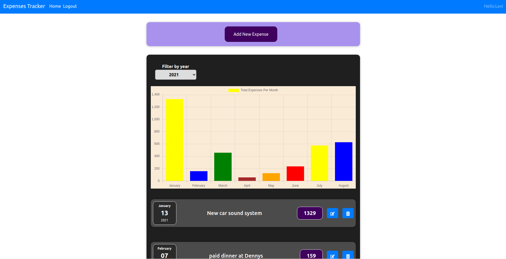

# Tracker-Expenses

> Project was about creating a Tracker-Expenses
> basically connecting to a REST API built in Rails
> and using React to display all of the Expenses
> 

## Built With

- NPM
- React
- React-DOM
- Redux [RTK Query]
- React-Chartjs-2
- React-Router
- React-Bootstrap
- React-Paginate
- Jest
- CSS
- ES6

## Live Demo

[Live Demo Link](https://vibrant-heyrovsky-039c58.netlify.app/)

## Getting Started

**To get a copy of the code please click on the green button on the top right corner that says Code**

### Prerequisites

- Node installed on your computer
- Npm as well

### Install

**Now to clone it to your local machine please open your terminal and paste this code `git@github.com:cvilla714/tracker-react-front.git`**

**Then you can go into the directory by typig `cd tracker-react-front`**

**Finally just type this command `npm install` this will install all of the depnedecies for the project also you might need to run an extra command to get the latest version of each dependecy please run `npm audit fix`**

### Usage

**Once you have gone through the process of installing the code you now run this command `npm run start` this will start the app and a new window will open in your browser with the app ready to be use**

### Test

**_In order to run the test please type the following command from the terminal `npm run test`_**

## Authors

👤 **Cosmel Villalobos**

- Github: [@cvilla714](https://github.com/cvilla714)
- Twitter: [@kckeyti](https://twitter.com/kckeyti)
- LinkedIn: [Cosmel Villalobos](https://www.linkedin.com/in/cosvilla/)

## 🤝 Contributing

Contributions, issues, and feature requests are welcome!

Feel free to check the [issues page](https://github.com/cvilla714/tracker-react-front/issues).

## Show your support

Give a ⭐️ if you like this project!

## Acknowledgment

- Microverse
- Gregoire Vella on Behance

## 📝 License

This project is [MIT](https://github.com/cvilla714/tracker-react-front/blob/master/LICENSE) licensed.
